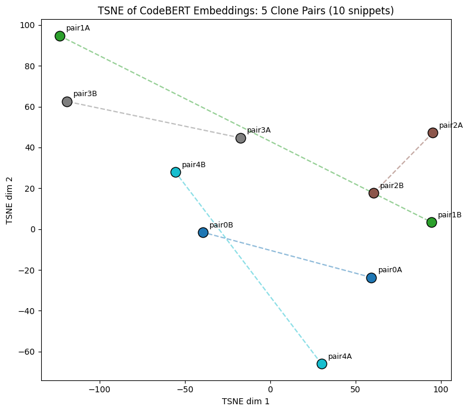

# Assignment 2: Code Embedding and Visualization

CSC 591: TAI4SE

## 1. Task and Setup

### 1.1 Data

I sampled 5 clone pairs (10 `.java` function snippets) from the CodeXGLUE benchmark (the [`BigCloneBench`](https://huggingface.co/datasets/google/code_x_glue_cc_clone_detection_big_clone_bench) configuration). I streamed the dataset using a random seed and only pulled rows where `label == True`, so that every pair I retrieved would be a true labeled clone. I kept the first 5 rows that were retrieved and split them into 10 individual snippets. Each snippet is tagged with its pair index (0-4) and side (A/B).

If you are curious as to what the 10 code snippets actually look like, they are available in `sampled_snippets.txt`.

### 1.2 Embedding Model

I then embedded each snippet with CodeBERT as per the instructions. Each snippet was tokenized, ran through a forward pass, and mean-pooled (individual token-level vectors were averaged to create one single snippet-level vector). The last hidden layer produced one 768-dimensional vector per snippet.

### 1.3 Visualization

I then projected the 10 embeddings (one per snippet) onto a 2D space using t-SNE with `perplexity=4` because the normal default of 30 is invalid for only 10 samples. I also used PCA initialization and again used a random seed so the results would be reproducible. This entire pipeline (embedding and plotting code) is in the python notebook [`assignment2.ipynb`](assignment2.ipynb). All of its dependencies are listed in [`requirements.txt`](requirements.txt).

## 2. Results

*t-SNE projection of the 10 CodeBERT embeddings. Points are color-coded by pair with a dashed line connecting each pair's individual snippets.*

### 2.1 Qualitative: What the t-SNE Plot Shows

**In the 2D projection plot, the five labeled clone pairs do not seem to cluster together as I expected.** If raw CodeBERT embeddings were able to properly encode similarity between clones, the points with dashed lines between them in the figure above would be close together in the 2D space. Instead, we see that:

- **Pair 2** (`pair2A`/`pair2B`) is visually the closest pair. Both points are in the upper-right region of the plot, but are still not neighbors since the unrelated snippet `pair1B` is closer to `2B` than `2A` is.
- **Pair 1** (`pair1A`/`pair1B`) are the farthest pair. The snippets in this pair are practically in opposite corners of the plot, and each one is closer to all 9 other unrelated snippets than to its own partner.
- The remaining pairs (0, 3, 4) are somewhere in between these extremes. Each pair's two points are closer to other unrelated snippets rather than sitting next to one another as neighbors.

While the pairs are not scattered at random (pair 2 is noticeably closer together than pair 1), no pair reasonably achieves the sort of isolated clustering we would expect if the embedding space had cleanly mencoded that they are clones.

### 2.2 Quantitative: Cosine Similarity in the Original 768-Dimension Space

Since a 2D t-SNE projection with only 10 points may have been messing with the true visual distances, I also went ahead and computed the pairwise cosine similarity based on the original 768-dimensional embedding space (the vectors prior to any low-dimension projection). I then checked, for each snippet, whether its nearest neighbor based on cosine similarity was its labeled clone.

| Snippet | Labeled Partner | Nearest Neighbor (similarity) | Match? |
|---|---|---|---|
| pair0A | pair0B | pair2B (0.996) | No |
| pair0B | pair0A | pair4B (0.997) | No |
| pair1A | pair1B | pair3B (0.995) | No |
| pair1B | pair1A | pair2B (0.997) | No |
| pair2A | pair2B | pair1B (0.995) | No |
| pair2B | pair2A | pair1B (0.997) | No |
| pair3A | pair3B | pair4B (0.995) | No |
| pair3B | pair3A | pair1A (0.995) | No |
| pair4A | pair4B | pair0A (0.984) | No |
| pair4B | pair4A | pair0B (0.997) | No |

*Nearest-neighbor check in the raw 768-dim embedding space (cosine similarity).*

**0 out of 10 snippets** have their labeled clone as the closest match in the raw embedding space via cosine similarity. Even pair 2, which looked closest together in the 2D t-SNE plot, did not match. All of the pairwise cosine similarities are extremely high and tightly clustered, ranging from about 0.960 to 0.997 across every pair of snippets. However, this includes snippets that are semantically unrelated. It seems raw cosine similarity in this space is not effective for discriminating between clones and just any unrelated code. This is quite consistent with what the t-SNE plot is suggesting, and is arguably a worse performance of the encoder when measured this way.

### 2.3 Summary of Findings

In both the visual and numerical evaluation methods, the raw CodeBERT embeddings do not properly separate true clone snippets from unrelated code snippets (for this 10-snippet sample).

## 3. Further Analysis (Why These Results?)

- **CodeBERT-base isn't a similarity-trained embedding model.** After diving deeper into CodeBERT's development, I found out that during training, it was pushed to become good at predicting missing tokens using local context after they were masked out. As a result of this training, the model is likely better at representing token-level signals rather than representing entire functions. Since this higher snippet-level meaning was never supervised in training, we actually can't expect it to perform well at this task.
- **We are using mean pooling to extract one vector out of an entire snippet, which isn't the best strategy.** CodeBERT does token-level embedding. This means that if we have a snippet of n tokens, it outputs n vectors that we then mean-pool (average) into one single snippet-level embedding. This isn't the best strategy because averaging the n token-level vectors that were never meant to be averaged will generally result in a poor summary vector, since a great deal of meaningful token-level signal will be diluted through this process.
- **The clone label has multiple types.** In the dataset we're using, labeled clones include not only textually similar code, but also semantically similar code — snippets/functions that execute the same behavior but have different implementations (code that, at first glance, would look wildly different to a human until inspecting what it does). This is the monumental task that we seek to accomplish with these encoders, as your run-of-the-mill natural language encoders would fundamentally struggle to semantically relate such pairs. As such, this is a far more difficult signal for CodeBERT, which is a more general-purpose encoder, to pick up without having been tuned specifically for this task.
- **Our small sample size of 10 makes the 2D t-SNE projection unstable.** With such little data, the visual closeness in the 2D plot is sensitive to whatever perplexity and random seed configuration we use. Therefore, it may not necessarily reflect the true distances of pairs in the original 768-dim space, which is exactly what we saw.
