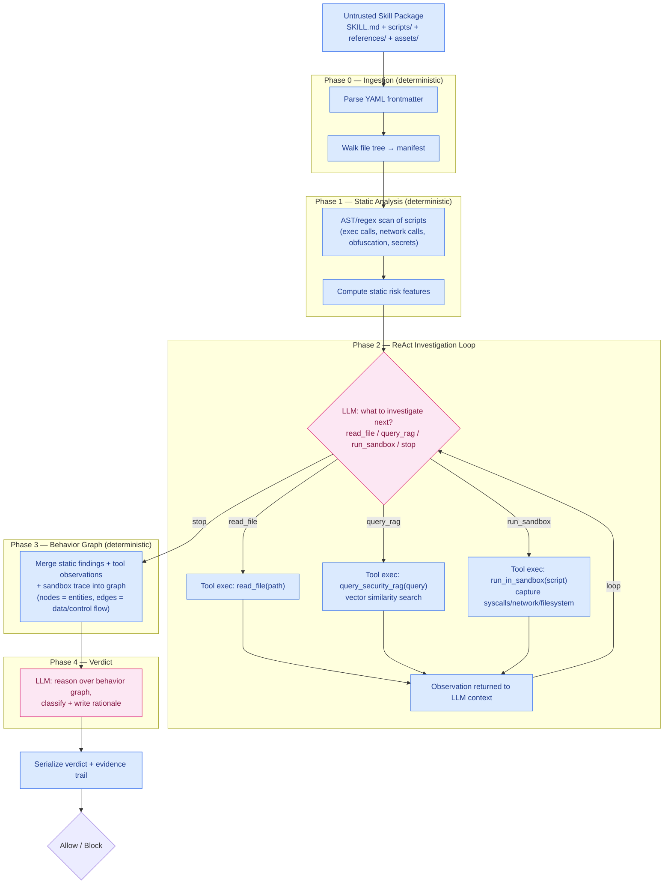

# Agent Skill/Supply-Chain Auditor

---

## 1. Problem Statement

### Task definition (input → output)
- **Input:** a third-party Agent Skill package (`SKILL.md` + bundled `scripts/`, `references/`, `assets/`) *before* a coding agent (Claude Code, Codex, etc.) trusts or loads it.
- **Output:** a yes/no verdict, potentially with supporting evidence (static findings, sandbox behavior, behavior graph).

### Why it matters / who benefits
Agent Skills bundle natural-language instructions **with executable code** that runs on the user's machine. There is an ungated trust boundary there, since installing a skill is more like installing a package than reading a doc.

**Beneficiaries:**
- End users of coding agents (protected from malicious behavior)
- Skill registries/marketplaces (need a gate before publishing)
- Agent vendors (added pre-check that isn't being done by agent providers).

### Challenges
- The instructional body of `SKILL.md` is freestyle prose without a schema, so a skill can simply lie about what it does upfront. This intent can't be fully extracted deterministically (only the YAML frontmatter and file tree can).
- Static inspection by itself will miss payloads that only appear at runtime (built strings, conditional triggers, second-stage fetches).
- Malicious intent can be invisible in the instructions, invisible in the code, and only visible when you connect instruction + script + observed execution.
- A malicious skill could try to prompt-inject the very agent that's supposed to judge it, so the auditor has to sit outside that trust boundary.
- Over-blocking skills will kill adoption (false positives on benign skills), and under-blocking defeats the purpose (missed malicious skills). This is why we'll use classification metrics such as precision, recall, and F1-score.

### State of the art & limitations
- Baselines: static/hybrid scanners (miss dynamic behavior), one-shot LLM classifiers (fast but can't connect cross-layer evidence, and can potentially be manipulated by the artifact they're classifying), LLM + RAG classifiers (better context, still single-pass).
- **Our research question:** does multi-step agentic investigation actually outperform a single LLM classification pass, or is the added complexity not worth it?

---

## 2. Trustworthiness Criteria

| Criteria | Description | How we'll measure it |
|---|---|---|
| **Security effectiveness** | Actually catches malicious skills across diverse attack types | Recall / F1 per attack category, across all 5 benchmarks |
| **Utility preservation** | Doesn't cripple adoption by blocking benign skills | False-positive rate, benign task utility |
| **Robustness to manipulation** | The auditor itself can't be talked out of a correct verdict by the artifact it's inspecting | Adversarial/injection test cases from SKILL-INJECT |
| **Generalization** | Works on attack sources/styles it hasn't seen, not just memorized patterns | Source-disjoint eval (MaliciousSkillBench split) |
| **Transparency / auditability** | A verdict comes with legible evidence a human can check, not a bare score | Manual inspection of behavior-graph rationales |
| **Operational cost** | A gate too slow/expensive to run on every install won't get adopted in practice | Latency, tool calls, token/API cost per audit |

---

## 3. Initial Experiment Plan

### Leading research questions
1. **RQ1**: Does ReAct-style investigation beat one-shot LLM classification?
2. **RQ2**: Does trusted security RAG improve generalization to unseen attack sources?
3. **RQ3**: Does runtime (sandbox) evidence reduce false positives without hurting recall?
4. **RQ4**: Does the behavior graph catch attacks that are invisible at any single layer?

### Brainstormed System Architecture (subject to change!)

**Legend:**
- blue = deterministic code (parsing, scanning, tool execution, graph construction, serialization)
- pink = LLM reasoning (deciding what to investigate, when to stop, and the final classification + rationale). 

Only the two pink nodes are non-deterministic. Everything else is auditable/testable code, which matters for the transparency/auditability criterion above.

*The auditor sits outside the agent's trust boundary: the skill under review is only ever a subject of investigation (fed into deterministic tool calls), never given control over the verdict logic.*

### Potential Benchmark Datasets (all public)
| Dataset | Size | Notes |
|---|---|---|
| MalSkillBench | 3,944 malicious / 4,000 benign | Runtime-verified, 108 attack configs; has a public Docker sandbox we can reuse |
| SkillTrustBench | 5,520 cases | 9 attack categories × 5 dependency layers |
| MaliciousAgentSkillsBench | 98,380 scanned / 157 confirmed | Real-world skills, behaviorally confirmed |
| SKILL-INJECT | 202 pairs | End-to-end injection attacks vs. Claude Code/Codex/Gemini CLI |
| MaliciousSkillBench | 9,740 skills | Random / structural-disjoint / **source-disjoint** splits - key for RQ2 |

_RAG will be only on security docs, not on benchmark datasets._

### Evaluation metrics
- **Precision, recall, F1, false-positive rate (overall + per attack category)**
- **Latency, tool-call count, token/API cost per audit**
- Source-disjoint generalization gap?
- Attack Success Rate (ASR) reduction?
- Benign task utility (measures if a legit skill still works post-audit)?

### Potential Ablation Plan
| System variant | Static | LLM | RAG | Sandbox | Graph |
|---|:---:|:---:|:---:|:---:|:---:|
| Static baseline | ✓ | | | | |
| One-shot LLM | | ✓ | | | |
| LLM + RAG | | ✓ | ✓ | | |
| ReAct + tools | | ✓ | ✓ | | |
| ReAct + sandbox | | ✓ | ✓ | ✓ | |
| **Full system** | | ✓ | ✓ | ✓ | ✓ |

### Baselines to beat
- Existing static/hybrid skill scanners
- One-shot frontier LLM classifier
- LLM + RAG classifier
- ReAct agent without sandbox
- Full system without the behavior graph